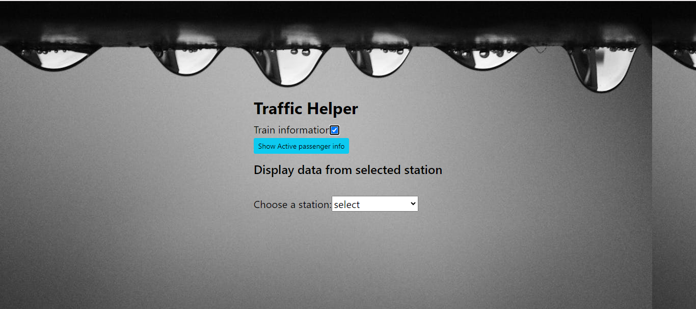
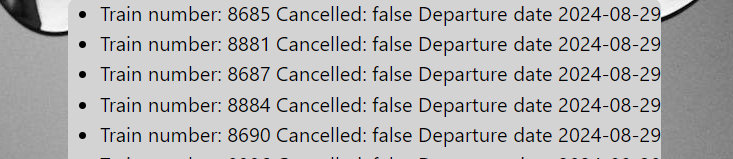
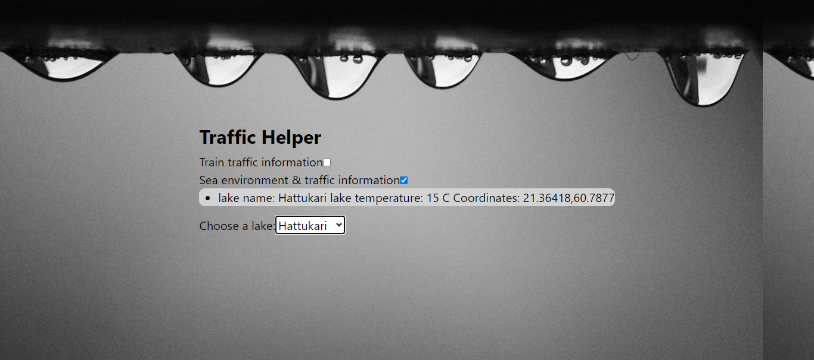

Project keywords: JavaScript, React, Open API, Bootstrap 5

The purpose of this program is to produce useful traffic and environmental information in clear language for the user to read. Data is retrieved from the open APIs provided by Digitraffic in accordance with the user's search criteria.

For now, the program only searches for rail traffic and lake data, but options for road traffic, sea traffic, etc. will be added to the program later.
You can read more about the APIs that the program uses here: https://www.digitraffic.fi/

Example image of the start page, where the railway traffic data search has been selected to be used

Specifications

Data is retrieved from the API interface using API endpoints and a JavaScript fetch method.
Then the retrieved data is converted to Json format and looped in a forEach loop. Finally, the information is displayed inside the html li elements as clear text.

An example image that has been searched for trains departing from Helsinki railway station, their numbers and information on whether they have been canceled or not.

An example picture where the information of a lake called Hattukari has been retrieved. information to be displayed is e.g. lake temperature and coordinates.

All search criteria entered by the user are passed as parameters to the api endpoint. for example, the function of the program, where railway information can be searched based on the station, is implemented with the html-select element, where the javaScript function saves the station selected by the user and sends the station as a parameter.

