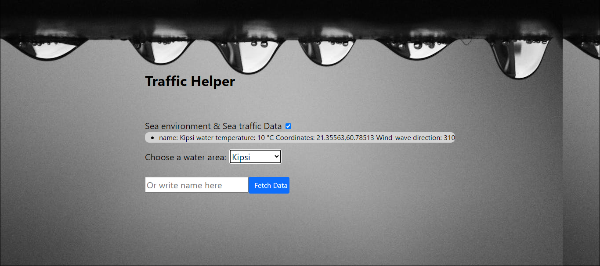
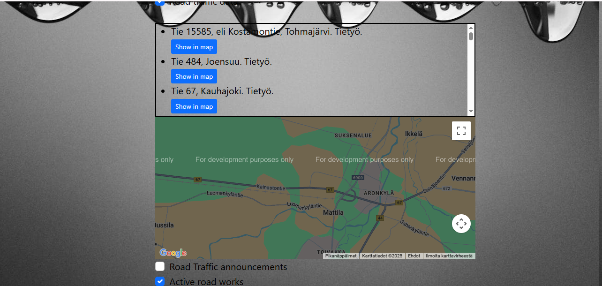

Project keywords: JavaScript, React, Open API, Bootstrap 5

The purpose of this program is to produce useful traffic and environmental information in clear language for the user to read. Data is retrieved from the open APIs provided by Digitraffic in accordance with the user's search criteria.

The program currently searches for rail traffic data, road traffic data, and marine traffic and marine environment data. You can read more about the APIs that the program uses here: https://www.digitraffic.fi/

Example image of the start view. Clicking on the checkbox invokes a new react component that shows the user an input field, a dropdown menu, and other components that allow the user to set search criteria for the information being searched for.

Specifications

Data is retrieved from the API interface using API endpoints and a JavaScript fetch method.
Then the retrieved data is converted to Json format and looped in a forEach loop. Finally, the information is displayed inside the html li elements as clear text.

Each line of retrieved data is displayed in its own li element and the elements are created inside the forEach loop with the javaScript createElement method.

All search criteria entered by the user are passed as parameters to the api endpoint. for example, the function of the program, where railway information can be searched based on the station, is implemented with the html-select element, where the javaScript function saves the station selected by the user and sends the station as a parameter.

Readability of the response text

The text is mostly readable. However, some extra characters from the answers have been removed to improve the user experience using the JavaScript substitution method.

the replacement method is executed automatically in the forEach loop

Sample images of the information searched and received using the search criteria

An example view where the user has searched for valid train passenger bulletins and the departure and arrival times and route of train 45 on 30.8.24

An example image from which the information of the water area called Kipsi has been retrieved. the displayed information is, for example, the temperature of the water, the coordinates and the direction of the wind wave. The user can also use the input field to search for the desired water area.

Example picture where the user has retrieved all Finnish road work notices from the API.
The div element where the traffic announcements are displayed has a max-width value that prevents the div element from growing too large if there are a lot of active traffic announcements. the scroll bar makes it easier to browse notifications.

