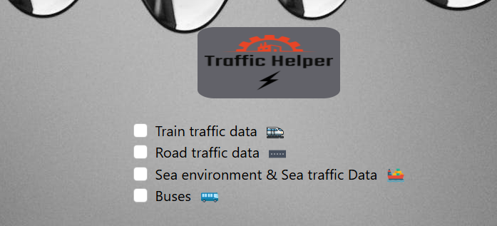
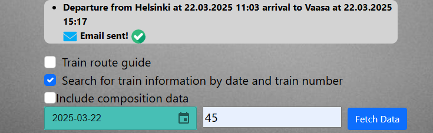
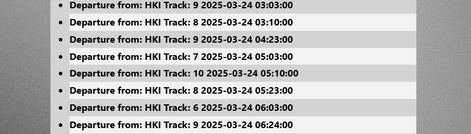
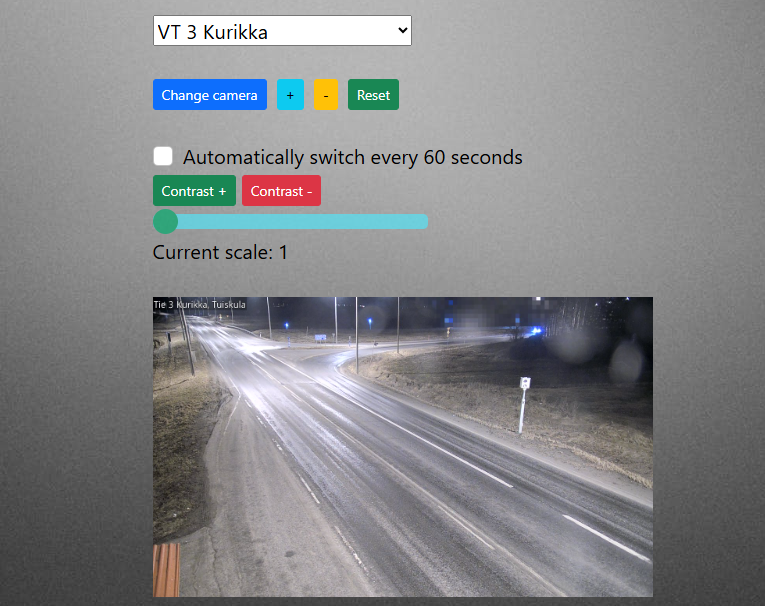
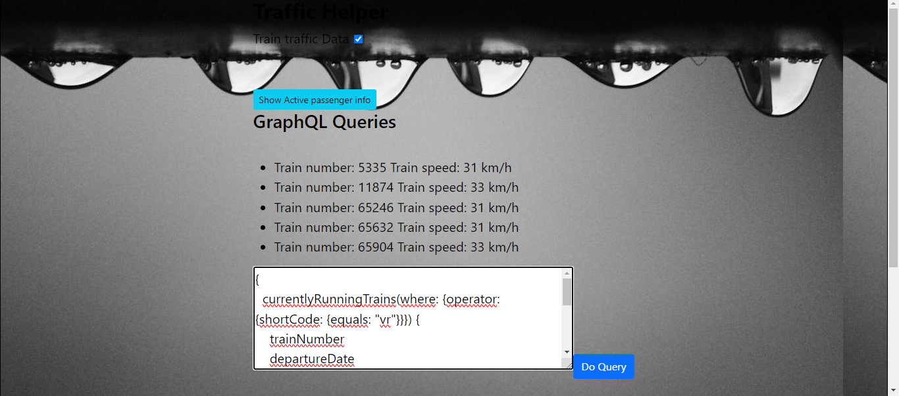

Project keywords: JavaScript, React, SpeechSynthesis API, GraphQL, Bootstrap 5, Material-UI, JSON

The purpose of this program is to produce useful traffic and environmental information in clear language for the user to read. Data is retrieved from the open APIs provided by Digitraffic in accordance with the user's search criteria.

The program currently searches for rail traffic data, road traffic data, and marine traffic and marine environment data. You can read more about the APIs that the program uses here: https://www.digitraffic.fi/

Example image of the start view. Clicking on the checkbox invokes a new react component that shows the user an input field, a dropdown menu, and other components that allow the user to set search criteria for the information being searched for. The checkboxes use Bootstrap 5 stacked style. The logo at the top was created with the freelogodesing.org logo creation tool. The logo image has a 12% radius at the corner.

SPECIFICATIONS

Data is retrieved from the API interface using API endpoints and a JavaScript fetch method.
Then the retrieved data is converted to Json format and looped in a forEach loop. Finally, the information is displayed inside the html li elements as clear text.

Each line of retrieved data is displayed in its own li element and the elements are created inside the forEach loop with the javaScript createElement method.

All search criteria entered by the user are passed as parameters to the api endpoint. for example, the function of the program, where railway information can be searched based on the station, is implemented with the html-select element, where the javaScript function saves the station selected by the user and sends the station as a parameter.

READABILITY OF THE RESPONSE TEXT

The text is mostly readable. However, some extra characters from the answers have been removed to improve the user experience using the JavaScript replace method. the replace method is executed automatically in the forEach loop.
Sample images of the information searched and received using the search criteria.

DATA SEARCH FROM TRAINS AND TRAIN STATIONS.

User can search for any VR train information using train number and date.

An example view where the user has searched for valid train passenger bulletins and the departure and arrival times and route of train 45 on 22.3.25. The date is selected from the MUI DatePicker component and the train number is entered in the input field. The API call requires a date in the format YYYY-DD-MM. The selected date is formatted in the required format, using the format method of the DayJS library.

ROUTE GUIDE FOR TRAINS

The user can search for routes by entering the departure station, destination station and travel date. The application searches information using these criteria and displays a list of trains matching the criteria to the user. The result shows the user the departure time, departure date and departure track.

Example view of the result where the user has searched for trains from Helsinki to Tampere on the date 24.3.25.

RAILWAY PASSENGER INFORMATION

The user can search for passenger information by station. The station is selected from the HTML select component. Each selection has a value attribute containing the station abbreviation, which is stored in a state variable and sent to the JavaScript function performing the search using the onChange event handler when the user has selected the desired station.

Example image where the user has selected Helsinki Station and retrieved active passenger information. Passenger information is displayed in an li element, where every other row uses the CSS color code #f2f2f2 and the  line-height is 1.8.

SEA / WATER AREA DATA

the user can search for information about water bodies and also display the location of the water body on Google Maps. The Google Maps feature is embedded in the application using this library: https://www.npmjs.com/package/@react-google-maps/api

An example image from which the information of the water area called Kipsi has been retrieved. the information displayed is, for example, the water temperature, coordinates and the direction of the wind wave. A Google Maps image of the water area can be displayed by clicking on the checkbox. the map image gets the necessary coordinates from the API.
When you click the Convert text to speech checkbox, the application converts the retrieved data into speech using the SpeecSynthesis API. Finally, the application plays the result through the device speakers.

The user can also search for the desired water area using the input field.
The API search works with the siteNumber value, so the "show site numbers" button searches and displays the names of the water areas and the "siteNumber" values ​​to the user, making it easy for the user to select the desired water area.  The water area site numbers are clickable. Each site number has a Click event listener that automatically adds the site number to the input field used in the water area search upon click. The contents of the input field are passed as a parameter to the API endpoint that performs the data retrieval.

Sample image of the list of available water areas.

VIEWING WEATHER CAMERAS

Weather camera images are retrieved from weathercam.digitraffic.fi/(id) The images of the camera to be displayed are selected from the html selection component and the selected image is displayed in the html img element. The URLs of the camera images are stored in variables and the selected component has an onChange event handler function that performs the search and display of the user's desired image. The image of each weather camera can be changed by pressing the "change camera" button. There are 3 different angles for each camera.

An example picture where the user has selected a road camera from the html select component

Example image when the user has clicked the "change camera" button and the camera image has changed.

ROAD TRAFFIC DATA

The user can search for various road traffic information, such as ongoing road works and active road traffic alerts.

Example image where the user has searched for all ongoing roadworks in Finland and opened one of the roadworks in the Google Maps map view. Each roadwork has a Bootstrap 5 style button, which the user can click to open the roadwork location in the Google Maps view. The latitude/longitude coordinates of the roadwork are stored in React State variables after the button is clicked and sent as parameters to the Maps component implementing the map view.

GRAPHQL QUERIES

GraphQL API queries are available for rail traffic and user can write queries themselves. queries are written to the textarea element and stored in a state variable. GraphQL API queries are implemented with the Apollo client.

Example image where a user writes a query to Digitraffic's rail traffic GrapQL API. The survey searches for the first 5 trains with a speed of more than 30 km/h

